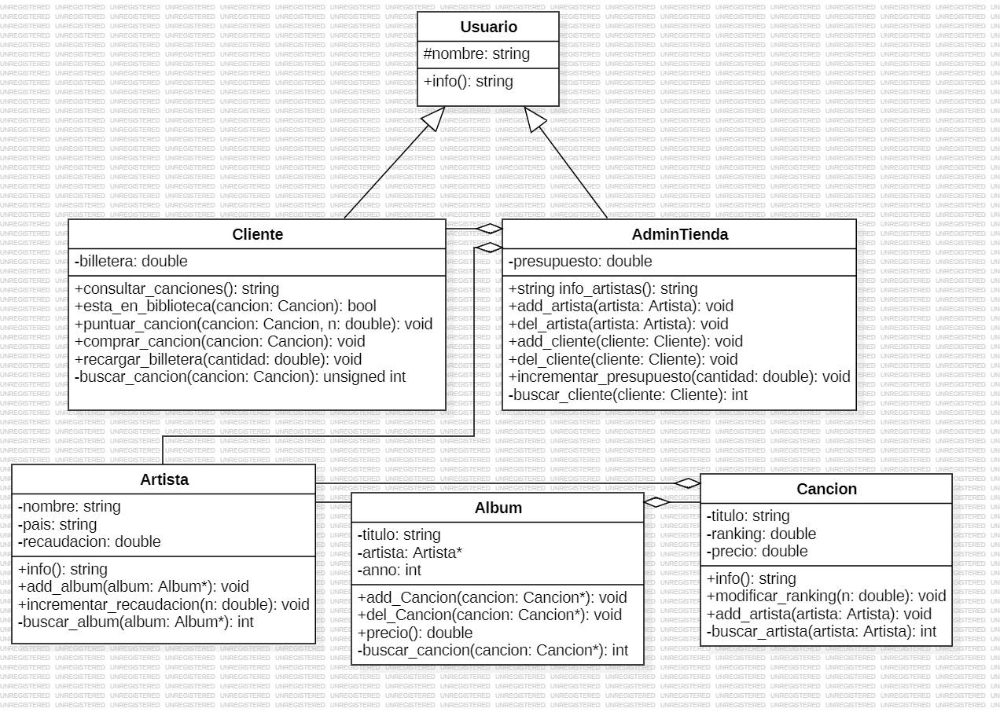

# PROYECTO UNIVERSITARIO: Sistema Digital para Tienda de Música

## Introducción

Este proyecto es una aplicación desarrollada en C/C++ para la gestión de una tienda de música digital. La aplicación permite a los usuarios explorar, buscar y comprar canciones de diferentes artistas, gestionar sus bibliotecas personales y realizar operaciones administrativas como el registro de nuevos artistas y clientes.

## Autora

- **Adriana María Garay Chávez**

## Curso

- **2024**

## Descripción del Proyecto

La idea principal de este proyecto es programar un sistema para una tienda digital de música. Se han implementado elementos como usuarios del sistema (trabajadores de la tienda y sus clientes), artistas con los que la tienda tiene contratos y sus álbumes y canciones. Este sistema utiliza el paradigma de programación orientada a objetos (POO) y el lenguaje de programación C++. Se ha diseñado una interfaz por consola amigable para el usuario objetivo, permitiendo ejecutar operaciones de forma fluida y eficiente.

## Funcionalidades

El sistema ofrece una interfaz de usuario con opciones para iniciar sesión como Cliente o Administrador, permitiendo realizar diversas acciones como consultar canciones, puntuar canciones, comprar canciones, recargar billetera, registrar nuevos artistas y clientes, entre otras.

## Análisis y Diseño de la Aplicación

El proyecto se estructura en torno a varias clases que representan los diferentes componentes del sistema, incluyendo Usuario, AdminTienda, Cliente, Artista, Album y Canción. Estas clases permiten la gestión de la información de la tienda, incluyendo la base de datos de canciones, la biblioteca de canciones de los clientes, y la información de los artistas y álbumes.

### Clases Principales

- **Usuario**: Clase base para todos los usuarios del sistema.
- **AdminTienda**: Representa al administrador de la tienda, con métodos para gestionar artistas y clientes.
- **Cliente**: Representa a un cliente de la tienda, con métodos para gestionar su biblioteca de canciones y billetera.
- **Artista**: Representa a un artista en la tienda de música, con métodos para gestionar sus álbumes y recaudación.
- **Album**: Representa un álbum en la tienda de música, con métodos para gestionar sus canciones y precio.
- **Cancion**: Representa una canción en la tienda de música, con métodos para gestionar su título, ranking, precio y artistas.

### Funcionalidades Adicionales

- **Sobrecarga de Operadores**: Se han sobrecargado los operadores == y != para facilitar la búsqueda de artistas, álbumes y canciones.
- **Uso de Punteros**: Se han utilizado punteros para manejar las relaciones entre las clases y optimizar el uso de memoria.
- **STL Vector**: Se ha utilizado la clase vector para manejar listas de objetos, facilitando la gestión de colecciones de canciones, álbumes y artistas.
- **Manejo de Excepciones**: Se han implementado mecanismos de manejo de excepciones para validar los datos introducidos por el usuario y evitar errores.

## Conclusión

Este proyecto demuestra la aplicación de conceptos de programación orientada a objetos y el uso eficiente de las características del lenguaje C++. La implementación de un sistema de gestión para una tienda de música digital es un ejemplo práctico de cómo se pueden utilizar estos conceptos para desarrollar aplicaciones complejas y eficientes.
